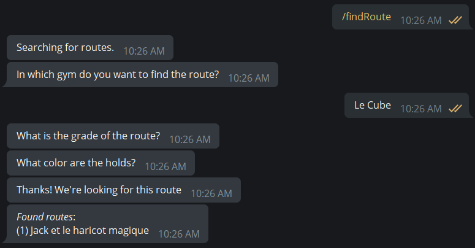

# heig-MAC/project


Un bot Telegram pour tout ce qui est lié à la grimpe. Réalisé dans le cadre du mini-projet du cours MAC à la HEIG-VD.

:pushpin: Slides [en PDF](SLIDES.pdf) :pushpin:

:pushpin: Modèle [sur Miro](https://miro.com/app/board/o9J_lZlt3Rw=/) :pushpin:

## Équipe

| Nom                                    |                                  |
|----------------------------------------|----------------------------------|
| Matthieu Burguburu                     | matthieu.burguburu@heig-vd.ch    |
| Alexandre Piveteau                     | alexandre.piveteau@heig-vd.ch    |
| Guy-Laurent Subri                      | guy-laurent.subri@heig-vd.ch     |

## Structure

1. [Mise en place du projet](#mise-en-place-du-projet)
2. [Structure du Bot](#structure-du-bot)
3. [Guide utilisateur](#guide-utilisateur)
4. [Modèle de données](#modèle-de-données)
    - [MongoDB](#mongodb)
    - [Neo4J](#neo4j)
5. [Requêtes effectuées](#requêtes-effectuées)

## Mise en place du projet

Pour faire tourner le bot en local, il vous faudra:

- [Docker compose](https://docs.docker.com/compose/); et
- un [bot API token](https://core.telegram.org/bots/api) Telegram.

Il vous faudra aussi créer un fichier nommé `.env` dans `./docker/topologies/dev` :

```sh
> cat ./docker/topologies/dev/.env

TELEGRAM_BOT_DEBUG=false
TELEGRAM_BOT_TOKEN=123_YOUR_TELEGRAM_API_TOKEN
```

Le lancement du bot se fait de la manière suivante:

```sh
> ./run-compose.sh
```

Le bot restera actif jusqu'à ce qu'il reçoive un SIGTERM.

## Structure du bot

Notre projet est écrit en Golang, ce qui nous permet de profiter de bibliothèques officielles pour accéder à [MongoDB](go.mongodb.org/mongo-driver) et [Neo4J](https://github.com/neo4j/neo4j-go-driver). Nous utilisons aussi une [bibliothèque pour accéder à l'API Telegram](github.com/go-telegram-bot-api/telegram-bot-api).

La structure du code est la suivante (des fichiers liés à Docker et à la documentation ont été masqués par soucis de brièveté) :

```
.
├── README.md
├── go.mod
├── go.sum
└── pkg
    ├── commands
    │   ├── ***.go
    │   └── keyboards
    │       └── ***.go
    ├── controller
    │   ├── controller.go
    │   └── handleUser.go
    ├── main.go
    ├── types
    │   ├── attempt.go
    │   ├── comm.go
    │   ├── command_definition.go
    │   ├── gym.go
    │   ├── route.go
    │   └── userData.go
    └── utils
        └── utils.go
```

Le paquet `types` contient les différents types de données stockés et lus depuis MongoDB et Neo4J. C'est là que les différentes requêtes se trouvent, ainsi que les scripts de création des différents types d'entités.


### Distribution des commandes

Quand le serveur lancé, il commence à boucler sur les _updates_ émises par l'API de bot Telegram. Nous utilisons notre `controller.Controller` pour gérer une _goroutine_ pour chaque utilisateur qui communique avec le bot. Ensuite, chacune de ces _goroutines_ se verra attribué les messages propres à un utilisateur Telegram.

Les commandes sont définies par une `types.CommandDefinition`, qui a la structure suivante :

```go
types.CommandDefinition{
	Command:       "cmd",
	Description:   "Command description.",
	Instantiation: controller.instantiateXXX,
}
```

Ces définitions sont enregistrées dans le contrôleur, et permettent aux goroutines des utilisateurs d'effectuer des commandes avec plusieurs étapes suivies de manière indépendante.

### Structure d'une commande

Chaque commande est définie dans le paquet `commands`. Les commandes fonctionnent comme des machines d'état, qui bouclent sur les `tgbotapi.Update` émises et, en fonction de l'état actuel (le `stage`) de la commande, décident de "progresser" à l'étape suivante ou non. Les commandes peuvent émettre un signal de terminaison quand elles ont fini de s'exécuter. Les commandes s'exécutent dans des nouvelles _goroutines_, et peuvent être arrêtées par le contrôleur quand une nouvelle commande est émise par un utilisateur.

Certaines commandes ou interactions utilisent des _inline keyboards_ Telegram. Ceux-ci sont définis dans le paquet `keyboards`, et peuvent être créés à partir d'une slice de `[]Choice` via la fonction `keyboards.NewInlineKeyboard`.

## Guide utilisateur

Notre bot permet à des utilisateurs de rentrer des voies dans différentes salles, de leur attribuer des attributs, d'enregistrer des tentatives. Il y a aussi une composante sociale : les utilisateurs peuvent se suivre les uns avec les autres.

Lors de son lancement avec la commande `/start`, le bot indique quelles commandes sont disponibles :

```
/start : The start command shows available commands
/addRoute : The addRoute command will allow you to create a new route
/climbRoute : The climbRoute command will allow you to save an attempt
/findRoute : The findRoute command will allow you to find the name of routes
/follow : The follow will allow you to follow another user
/unfollow : The unfollow will allow you to stop following another user
/profile : The profile will allow you to see infos about an user, like best route climbed and follower numbers
```

Les commandes sont les actions suivantes :

+ `addRoute` crée une nouvelle route avec quelques méta-données. On commence par rentrer le nom de la salle, suivi du nom de la route, de la couleur de ses prises en finalement de son niveau de difficulté. Les routes sont créées pour tous les utilisateurs.

```
User [input]    : /addRoute
Bot             : In which gym would you like to add the route?
User [input]    : Le Cube
Bot             : What is the name of the route?
User [input]    : Jack et le haricot magique
Bot             : What is the grade of the route ?
User [keyboard] : 5A
Bot             : What colors are the holds ?
User [keyboard] : Green
Bot             : Thanks! We've added this route.
```


+ `climbRoute` crée une nouvelle tentative sur une route. On commence par rentrer le nom de la salle et de la route, notre performance lors de la tentative, notre impression de la difficulté de la route, ainsi qu'une note de notre appréciation de la route.
```
User [input]    : /climbRoute
Bot             : Adding a new attempt to an existing route.
Bot             : In which gym are you climbing?
User [input]    : Le Cube
Bot             : What is the name of the route?
User [input]    : Jack et le haricot magique
Bot             : What was your performance?
User [keyboard] : Flashed
Bot             : How would you grade the route?
User [keyboard] : 5B
Bot             : How enjoyable was the route?
User [keyboard] : 8
Bot             : Long live the swollen forearms!
```


+ `findRoute` recherche des routes existantes. On commence par rentrer le nom de la salle, la difficulté de la route que l'on cherche ainsi que la couleur de ses prises. Le bot renvoie alors le nom de toutes les routes existantes correspondant à ces caractéristiques.
```
User [input]    : /findRoute
Bot             : Searching for routes.
Bot             : In which gym do you want to find the route?
User [input]    : Le Cube
Bot             : What is the grade of the route?
User [keyboard] : 5A
Bot             : What color are the holds?
User [keyboard] : Green
Bot             : Thanks! We're looking for this route
Bot             : Found routes:
                  (1) Jack et le haricot magique
```


+ `follow` permet de suivre des utilisateurs et obtenir des recommandations de nouvelles personnes à suivre. Si l'utilisateur n'a pas de username Telegram, il est aussi aussi possible de taper son nom complet (`John Snow`) à la place.
```
User [input]    : /follow
Bot             : What is @username of the person you want to follow?
User [input]    : glsubri
Bot             : You're now following @glsubri !
User [input]    : /follow
Bot             : What is @username of the person you want to follow?
                  Here are a few people you might know:
User [keyboard] : alexandrepiveteau
Bot             : You're now following @alexandrepiveteau !
```


+ `unfollow` permet de suivre des utilisateurs et obtenir des recommandations de nouvelles personnes à suivre.
```
User [input]    : /unfollow
Bot             : What is the @username you want to unfollow ?
User [keyboard] : alexandrepiveteau
Bot             : You're not following @alexandrepiveteau anymore !
```


## Modèle de données

## MongoDB

MongoDB nous sert à stocker certaines méta-données liées aux routes et aux salles (dénommées `gym` dans notre code). Nous avons mis en place les collections suivantes :

+ `gym`, qui contient les méta-données suivantes des salles:
    - `name`, le nom de la salle.
+ `routes`, qui contient les méta-données suivantes des routes:
    - `gym`, le nom de la salle dans laquelle se situe la route;
    - `name`, le nom de voie. Il est unique au sein d'une même salle;
    - `grade`, la difficulté de la voie. Elle est attribuée quand la voie est créée; et
    - `holds`, la couleur des prises de cette voie.
+ `attempts`, qui contient les méta-données des tentatives des utilisateurs:
    - `gym`, le nom de la salle pour cette tentative;
    - `route`, le nom de la route de la tentative;
    - `proposedGrade`, la difficulté estimée par l'utilisateur lors de la tentative;
    - `performance`, le résultat de la tentative de l'utilisateur; et
    - `rating`, la note attribuée par l'utilisateur à la voie.

## Neo4J

Neo4J nous permet de stocker les relations entre les gyms, les voies, les utilisateurs et leurs tentatives. Nous avons mis en place les noeuds suivants :

+ `Gym`, qui contient les attributs suivants:
    - `gymId`, l'identifiant MongoDB de la salle; et
    - `name`, le nom de la salle.
+ `Route`, qui contient les attributs suivants:
    - `id`, l'identifiant MongoDB de la voie;
    - `name`, le nom de la voie;
    - `grade`, la difficulté de la voie; et
    - `holds`, la couleur des prises de cette voie.
+ `User`, qui correspond à un utilisateur de notre bot et qui a les attributs suivants:
    - `name`, qui contient soit le username Telegram de l'utilisateur (s'il en possède un), soit son nom complet sur Telegram.
+ `Attempt`, qui correspond à une tentative de l'utilsateur et a les attributs suivants:
    - `id`, l'identifiant MongoDB de la tentative;
    - `proposedGrade`, la difficulté estimée par l'utilisateur;
    - `performance`, le résultat associé à la tentative (`flashed`, `succeeded` ou `failed`);
    - `rating`, la note attribuée par l'utilisateur.

Ces différents types de noeuds sont aussi liés par certaines relations :

+ `Attempt->[TRY_TO_CLIMB]->Route`, quand une tentative est effectuée sur une route particulière. Cette relation est créée lors de l'ajout de la tentative à la base de données;
+ `Route->[IS_IN]->Gym`, quand une route est créée dans une salle particulière; Cette relation est créée lors de l'ajout de la route;
+ `User->[CREATED]->Route`, quand une route est créée par un utilisateur spécifique. Cette relation est créée lors de l'ajout de la route; et
+ `User->[FOLLOWS]->User`, quand un utilisateur suit un autre utilisateur;
+ `User->[ATTEMPS]->Attempt`, quand un utilisateur fait une tentative sur une route.

## Requêtes effectuées

Dans chacune de commandes proposées par le bot, nous effectuons un certain nombre de requêtes afin stocker ou récupérer des données. Voici un extrait des requêtes les plus intéressantes:
+ `/follow` (get follower recommendations): `MATCH (me:User)-[:FOLLOWS]->()-[:FOLLOWS]->(following:User) WHERE me.name = $username AND NOT exists( (me)-[:FOLLOWS]->(following)) RETURN following`\
Récupère la liste des utilisateurs qui sont suivis par ceux que l'utilisateur courant suit, s'ils ne font pas déjà partie des utilisateurs suivis directement
+ `/profile` (get follower count): `MATCH (me:User)<-[f:FOLLOWS]-(followers) WHERE me.name = $username WITH me, count(f) as cFollowers return cFollowers`:\
Récupère le nombre d'utilisateur qui follow directement l'utilisateur courant. Une commande équivalente existe pour récupérer le nombre d'utilisateurs que l'utilisateur courant follow.
+ `/profile` (get favourite gym): `COMMAND`

## Exemple de graph Neo4J

Voici un extrait de l'UI Neo4J après quelques commandes de la part de 3 utilisateurs.


