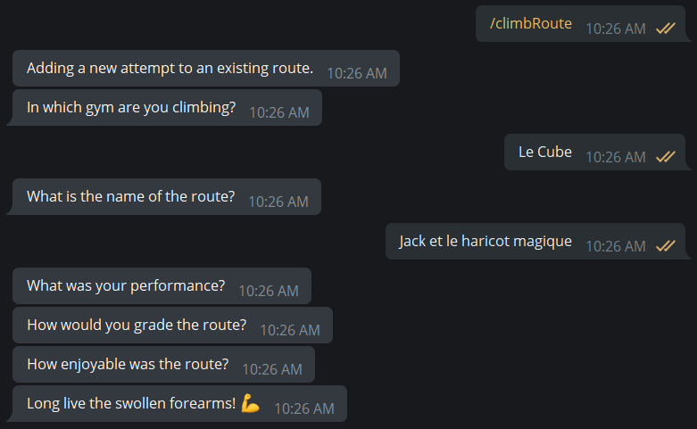

# heig-MAC/project


Un bot Telegram pour tout ce qui est lié à la grimpe. Réalisé dans le cadre du mini-projet du cours MAC à la HEIG-VD.

:pushpin: Modèle [sur Miro](https://miro.com/app/board/o9J_lZlt3Rw=/) :pushpin:

## Équipe

| Nom                                    |                                  |
|----------------------------------------|----------------------------------|
| Matthieu Burguburu                     | matthieu.burguburu@heig-vd.ch    |
| Alexandre Piveteau                     | alexandre.piveteau@heig-vd.ch    |
| Guy-Laurent Subri                      | guy-laurent.subri@heig-vd.ch     |

## Mise en place du projet

Pour faire tourner le bot en local, il vous faudra:

- [Docker compose](https://docs.docker.com/compose/); et
- un [bot API token](https://core.telegram.org/bots/api) Telegram.

Il vous faudra aussi créer un fichier nommé `.env` dans `./docker/topologies/dev` :

```sh
> cat ./docker/topologies/dev/.env

TELEGRAM_BOT_DEBUG=false
TELEGRAM_BOT_TOKEN=123_YOUR_TELEGRAM_API_TOKEN
```

Le lancement du bot se fait de la manière suivante:

```sh
> ./run-compose.sh
```

Le bot restera actif jusqu'à ce qu'il reçoive un SIGTERM.

## Guide utilisateur

Notre bot permet à des utilisateurs de rentrer des voies dans différentes salles, de leur attribuer des attributs, d'enregistrer des tentatives. Il y a aussi une composante sociale : les utilisateurs peuvent se suivre les uns avec les autres.

Lors de son lancement avec la commande `/start`, le bot indique quelles commandes sont disponibles :

```
/start : The start command shows available commands
/challenge : The challenge command will allow you to challenge a user you follow to climb a route
/addRoute : The addRoute command will allow you to create a new route
/climbRoute : The climbRoute command will allow you to save an attempt
/findRoute : The findRoute command will allow you to find the name of routes
/follow : The follow will allow you to follow another user
/unfollow : The unfollow will allow you to stop following another user
/profile : The profile will allow you to see infos about an user, like best route climbed and follower numbers
```

Les commandes sont les actions suivantes :

+ `addRoute` crée une nouvelle route avec quelques méta-données. On commence par rentrer le nom de la salle, suivi du nom de la route, de la couleur de ses prises en finalement de son niveau de difficulté. Les routes sont créées pour tous les utilisateurs.

```
User [input]    : /addRoute
Bot             : In which gym would you like to add the route?
User [input]    : Le Cube
Bot             : What is the name of the route?
User [input]    : Jack et le haricot magique
Bot             : What is the grade of the route ?
User [keyboard] : 5A
Bot             : What colors are the holds ?
User [keyboard] : Green
Bot             : Thanks! We've added this route.
```


+ `climbRoute` crée une nouvelle tentative sur une route. On commence par rentrer le nom de la salle et de la route, notre performance lors de la tentative, notre impression de la difficulté de la route, ainsi qu'une note de notre appréciation de la route.
```
User [input]    : /climbRoute
Bot             : Adding a new attempt to an existing route.
Bot             : In which gym are you climbing?
User [input]    : Le Cube
Bot             : What is the name of the route?
User [input]    : Jack et le haricot magique
Bot             : What was your performance?
User [keyboard] : Flashed
Bot             : How would you grade the route?
User [keyboard] : 5B
Bot             : How enjoyable was the route?
User [keyboard] : 8
Bot             : Long live the swollen forearms!
```


+ `findRoute` recherche des routes existantes. On commence par rentrer le nom de la salle, la difficulté de la route que l'on cherche ainsi que la couleur de ses prises. Le bot renvoie alors le nom de toutes les routes existantes correspondant à ces caractéristiques.
```
User [input]    : /findRoute
Bot             : Searching for routes.
Bot             : In which gym do you want to find the route?
User [input]    : Le Cube
Bot             : What is the grade of the route?
User [keyboard] : 5A
Bot             : What color are the holds?
User [keyboard] : Green
Bot             : Thanks! We're looking for this route
Bot             : Found routes:
                  (1) Jack et le haricot magique
```


+ `follow` permet de suivre des utilisateurs et obtenir des recommandations de nouvelles personnes à suivre.
```
User [input]    : /follow
Bot             : What is @username of the person you want to follow?
User [input]    : glsubri
Bot             : You're now following @glsubri !
User [input]    : /follow
Bot             : What is @username of the person you want to follow?
                  Here are a few people you might know:
User [keyboard] : alexandrepiveteau
Bot             : You're now following @alexandrepiveteau !
```


+ `unfollow` permet de suivre des utilisateurs et obtenir des recommandations de nouvelles personnes à suivre.
```
User [input]    : /unfollow
Bot             : What is the @username you want to unfollow ?
User [keyboard] : alexandrepiveteau
Bot             : You're not following @alexandrepiveteau anymore !
```


## Modèle de données

## Requêtes effectuées
